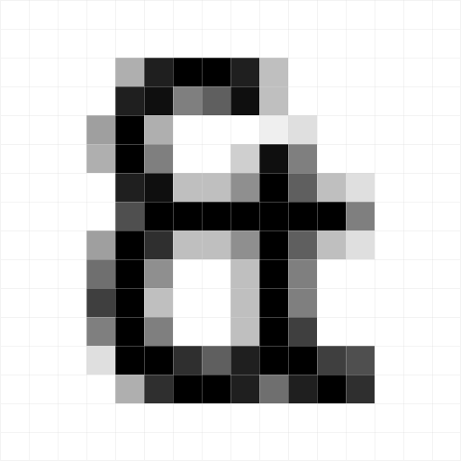
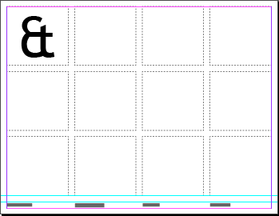

← [`ls`](README.md)

# Typography 2 / Lesson 1

0. [Preface](#bespoke-character)
1. [Brief](#brief)
2. [Work & Rubric](#work-amp-rubric)
3. [Warm-Up](#warm-up)
3. [Lectures](#lectures)
5. [Schedule](#schedule)
6. [Design Criticism](#design-criticism)
7. [Readings & Resources](#readings-amp-resources)
8. [Books & Magazines](#books-amp-magazines)
9. [Software](#software)

## Bespoke Character

Close-up of a 16 point ampersand set in Trebuchet MS viewed in Illustrator’s Pixel Preview mode.

> “The ampersand is the one glyph where type designers are able to let loose and be a little more creative.”
>
> —[Jeremiah Shoaf](https://www.typewolf.com/about), freelance designer and editor of [Typewolf](https://www.typewolf.com)

The ampersand (&): once considered the 27th letter of the alphabet; born of a Latin phrase; now a long-standing character; rich in personality and history that’s become a favorite among designers and type designers alike.

### Brief

Design a bespoke ampersand (&) for print and web, as an alternate glyph for a serif, sans-serif, or monospace web safe font.

### Work & Rubric

Copy and paste section into a new `issue` within your repo and title it as *Work & Rubric*. [`#tasklist`](https://github.com/blog/1825-task-lists-in-all-markdown-documents)

#### Standard

`20 points`

- [ ] Sketches begin on paper: graph, grid, dot, etc. (capture and document your process)
- [ ] Maintain a repo for this project on GitHub with sketches et al. assets (`.indd`, `.idml`, `.html`, etc.)
- [ ] Use of InDesign, Illustrator, or Sketch for ampersand design, and InDesign and Text Editor (HTML & CSS) for layout `#nophotoshop` `#nodreamweaverormuse`
- [ ] Use of black only, designer black or rich black, no grayscale

#### Different Designs for Different Sizes

`20 points`

Design an alternate `normal` or `bold` weight ampersand, working from a scale of a low-res favicon (1em x 1em or 16pt/px x 16 pt/px) through a hi-res banner type size (16em x 16em or 256pt/px x 256pt/px).

- [ ] One favicon @ 1em x 1em, `.png` and `.ico` format
- [ ] One display type size @ 2em x 2em, `svg` format
- [ ] One display type size @ 3em x 3em, `svg` format
- [ ] One banner type size @ 16em x 16em, `svg` format

#### Character

`20 points`

- [ ] Original (design)
- [ ] Unpredictable (experience)
- [ ] Whimsical (emotion)
- [ ] Elegant (bézier curves)

#### Printed Matter (Print Matters)

`20 points`

Design a poster, comparing and contrasting the web safe font’s original ampersand to yours in a range of real-world use cases.

- [ ] Use of character and paragraphs styles
- [ ] Exclusive use of selected web safe font for all other text: headings, body text, captions, etc.
- [ ] Print one or more posters, 18in x 24in or larger (19in x 25in for bleeds), black only (100% or 4-color black)
- [ ] Print on white or color 80# `text` or 65# `cover` or lighter weight paper stock
  - A color stock should be well considered `#colortalks`
  - If you do decide to make use of color paper stock, stay away from the use of knockout due to difficulties in reproducing even coverage of large amounts of black (toner) as a background
  - Output at a print shop with a large format A&E (Architectural & Engineering) black and white graphics plotter/photocopier
    - CCI Reprographics, `978 922 3773`, @ 110 Cabot Street, is a local print shop that can provide output and various paper stocks. Stop by or call ahead for pricing and paper stock availability. Call ahead and ask for John; tell him you’re a student studying design, and bring your files (`.idml` with all dependencies, or `.pdf`) with an 11in x 17in black and white proof, and any paper samples (with extras), so that he may better assist you. `#beprepared` `#beprofessional`
    - [French Paper Co.](http://www.frenchpaper.com) offers a lot of choices for 19in x 25in cut sheet paper in a range of colors and weights, and can be ordered in small counts of 25 (extra sheets come in handy) for under $35–50. Considering ordering paper in groups to save on costs `#frenchpaper`
    - **Note:** Paper stock in heavier weights will not run through a large format photocopier with good results; a paper jam or uneven toner coverage and fusing will result `#avoid`

#### Screen Time

`20 points`

Design a single-page, responsive webpage based on a simplified version of your printed poster.

- [ ] Use of CSS Grid Layout and media queries for small-to-wide responsive layout
- [ ] Use of optimized SVG files for ampersands with flexible images HTML and CSS
- [ ] Exclusive use of selected web safe font for all other text: headings, body text, captions, etc.
- [ ] Link ampersand favicon `.ico` and 512px x 512px `.png` for a Twitter/OG image

- - -

#### Style (Extra Credit)

*True italic*, not fake, slanted.

`20 points`

Design an alternate `italic` style (slanted) ampersand, working from a scale of a low-res favicon (1em x 1em or 16pt/px x 16 pt/px) through a hi-res banner type size (16em x 16em or 256pt/px x 256pt/px).

- [ ] One favicon @ 1em x 1em, `.png` and `.ico` format
- [ ] One display type size @ 2em x 2em, `svg` format
- [ ] One display type size @ 3em x 3em, `svg` format
- [ ] One banner type size @ 16em x 16em, `svg` format

### Warm-Up

`60 minutes`

#### And Per Sketch

> “Usually, letters help to form one another, by setting precedents and providing contexts. But the ampersand doesn’t receive any of that support. That makes it hard to draw, because so many different shapes might look plausible at first. But it also opens an unusually large window for experimentation and risk. It’s how the designer can put on a fireworks show in this one shape, especially in seriffed italics.”
>
> —[Tobias Frere-Jones](https://frerejones.com/about), one of the world’s leading typeface designers

#### Details

##### Instructor

1. As a class watch [*My Life in Typefaces* with Matthew Carter](https://www.ted.com/talks/matthew_carter_my_life_in_typefaces) `video`
2. As a class, discuss the importance and process of drawing type and watch [On Sketching](https://vimeo.com/11491627) `video`
3. Demo how to create an InDesign grid template for sketching using the gridify technique with custom character, paragraph, and object styles (see `/warm-ups/01-ampersand-sketch-grid/` for reference)

##### Student(s)

1. Select a serif, sans-serif, or monospace web safe font
2. Setup and save ampersand sketch grid
3. Print out two or three copies (one for now and a couple for later)
4. Sketch at least 8 ampersands in 30 minutes
5. Repeat for homework, sans time limit

> "If you haven’t surprised yourself yet, you haven’t done enough sketching."
>
> —[Josh Collinsworth](https://joshcollinsworth.com), designer

##### Materials

- A [good dark drawing pencil](https://www.leadfast.org/blog/2017/3/9/apsara-absolute-pencil-review), black pen or fine marker, and a [good eraser](http://apenchantforpaper.blogspot.com/2012/07/great-eraser-review-pentel-hi-polymer.html)

##### Web Safe Fonts

Select from the safest, most widely supported system fonts on Mac and Win, of the web safe fonts.

###### Serif

- [Georgia](https://en.wikipedia.org/wiki/Georgia_(typeface))
  - Matthew Carter, Microsoft, 1993
- [Times New Roman](https://en.wikipedia.org/wiki/Times_New_Roman)
  - Stanley Morrison, *The Times*, 1931

###### Sans-serif

- [Arial](https://en.wikipedia.org/wiki/Arial)
  - Robin Nicholas and Patricia Saunders, IBM, 1982
- [Arial Black](https://en.wikipedia.org/wiki/Arial)
  - Robin Nicholas and Patricia Saunders, IBM, 1982
- [Tahoma](https://en.wikipedia.org/wiki/Tahoma_(typeface))
  - Matthew Carter, Microsoft, 1994
- [Trebuchet MS](https://en.wikipedia.org/wiki/Trebuchet_MS)
  -  Vincent Connare, Microsoft, 1996
- [Verdana](https://en.wikipedia.org/wiki/Verdana)
  - Matthew Carter, Microsoft, 1996

###### Monospace

- [Courier](https://en.wikipedia.org/wiki/Courier_(typeface))
  - Howard “Bud” Kettler, IBM, 1955
- [Courier New](https://en.wikipedia.org/wiki/Courier_(typeface)#Courier_New)
  -  Redrawn by Adrian Frutiger, IBM, 1961

##### Hints

- [Sketching Out of My Comfort Zone: A Type Design Experiment](http://typographica.org/on-typography/sketching-out-of-my-comfort-zone-a-type-design-experiment/)
- [Typeface Mechanics: 001](https://frerejones.com/blog/typeface-mechanics-001/)
- [Daily Typesketch](https://www.flickr.com/photos/ninastoessinger/sets/72157629933739982/)
- [Gridify Magic](https://indesignsecrets.com/tip-week-gridify-magic.php)

##### Extras

- [The Grid System](http://thegridsystem.net/tags/indesign/)

### Lectures

1. [Bezier Curves and Type Design: A Tutorial](http://learn.scannerlicker.net/2014/04/16/bezier-curves-and-type-design-a-tutorial/)
2. Working with SVG
3. Responsive Grid Systems in Print (poster) and Web (webpage)

### Schedule

By week, and task(s).

Feel free to copy and paste to make a *Schedule* issue task list (update `- Task` to `- [ ] Task`). [`#tasklist`](https://github.com/blog/1825-task-lists-in-all-markdown-documents)

1. Ideas, Learn, and Make
  - Kickoff meeting and lecture
  - Warm-Up
  - Research and work session
  - Meeting and lecture(s)
  - First draft `wip` ampersand sketches — paper and digital
  - First draft `wip` poster and website comps — paper and digital
  - `eow` Review and feedback (`1:1` and GitHub comments)
2. Iterate, Revise, and Repeat
  - Meeting and lecture(s)
  - Revised `wip` ampersand sketches — paper and digital
  - Revised `wip` poster and website layout comps — digital only
  - `eow` Review and feedback (`1:1` and GitHub comments)
3. Review and Takeaways
 - Final ampersand sketches — digital only
 - Production-ready poster and webpage layout and HTML/CSS
 - Proofing and printing (at school or print shop) and publishing (GitHub)
 - `eow` Final review

### Design Criticism

*Please skim before attending design critiques.*

- [Discussing Design: The Art of Critique](https://www.slideshare.net/adamconnor/discussing-design-the-art-of-critique) `slides`
- [Design Criticism and the Creative Process](https://alistapart.com/article/design-criticism-creative-process)
- [9 Rules For Running A Productive Design Critique](https://www.fastcodesign.com/3019674/9-rules-for-running-a-productive-design-critique)
- [Sharing Our Work: Testing and Feedback in Design](https://alistapart.com/article/sharing-our-work-testing-feedback-in-design)
- [I Don’t Like It](https://alistapart.com/column/i-dont-like-it)

### Readings & Resources

Copy and paste section into a new `issue` within your repo and title it as *Readings & Resources*. [`#tasklist`](https://github.com/blog/1825-task-lists-in-all-markdown-documents)

**Note:** Prefixed `[ ] →` links are required reading (or viewing). `#readme`

#### Ampersand (&)

- [ ] → [This is What Happens When You Put Out a Call to Designers For Ampersands](https://eyeondesign.aiga.org/this-is-what-happens-when-you-put-out-a-call-for-ampersands/)
- [ ] → [Why Designers Love The Ampersand](https://www.fastcodesign.com/3055622/why-designers-love-the-ampersand)
- [ ] → [The Ampersand, part 1 of 2](http://www.shadycharacters.co.uk/2011/06/the-ampersand-part-1-of-2/)
- [The Ampersand, part 2 of 2](http://www.shadycharacters.co.uk/2011/06/the-ampersand-part-2-of-2/)
- [The Ampersand, part 2½ of 2](http://www.shadycharacters.co.uk/2011/07/the-ampersand-part-2%C2%BD-of-2/)
- [Our Middle Name](https://www.typography.com/blog/our-middle-name)
- [Use the Best Available Ampersand](http://vault.simplebits.com/notebook/2008/08/14/ampersands-2/) `#classic`

#### Inspiration

- [ ] → [Ampersand, &C.](http://uncommon-typography.tumblr.com)
- [ampersandampersand](http://ampersandampersand.tumblr.com)
- [ ] → [Wired Asked 15 Typographers to Introduce Us to Their Favorite Glyphs](http://www.typographher.com/blog/2016/1/27/wired-asked-15-typographers-to-introduce-us-to-their-favorite-glyphs)
- [ ] → [Jessica Hische @ The Design Conference 2016](https://vimeo.com/187617103) `video`
- [Hoefler & Co.](https://www.typography.com/blog/)
- [Tobias Frere-Jones](https://frerejones.com/blog)
- [Erik Spiekermann](http://spiekermann.com/en/)
- [David Johnathan Ross](https://djr.com/notes/)
- [Fontsmith](http://www.fontsmith.com/blog)
- [ ] → [About Fontsmith](https://vimeo.com/64268590) `video`
- [The story of the Fontsmith library](http://www.10yearsintype.com)
- [Type Network](http://www.typenetwork.com)
- [Typofonderie](https://typofonderie.com)
- [ ] → [Type Specimens (Curated from around the web)](https://typespecimens.io)
- [Daily Type Specimen](http://dailytypespecimen.com/archive)
- [An alphabet made from classic rock band logos](http://kottke.org/17/07/an-alphabet-made-from-classic-rock-band-logos)
- [Type Thursday (Medium)](https://medium.com/type-thursday)

#### Type Design

- [ ] → [Design Notes: The Ampersand (&)](http://letterpunch.blogspot.com/2014/10/glyph-design-ampersand.html)
- [ ] → [Typographic Trickery Shifts a Font From Paper to Pixels](https://www.wired.com/2016/10/typographic-trickery-shifts-font-paper-pixels/)
- [ ] → [A Typeface Designer’s Illustrated Tour of How to Create a Font](http://www.slate.com/blogs/the_eye/2015/02/02/obsidian_by_jonathan_hoefler_and_andy_clymer_of_hoefler_co_is_a_contemporary.html)
- [ ] → [Bezier Curves and Type Design: A Tutorial](http://learn.scannerlicker.net/2014/04/16/bezier-curves-and-type-design-a-tutorial/)
- [ ] → [Lo-Res by Zuzana Licko](http://www.emigre.com/EFfeature.php?di=101)

#### Font Hinting

- [ ] → [Font Hinting](https://www.typotheque.com/articles/hinting)
- [ ] → [Font Hinting and the Future of Responsive Typography](https://alistapart.com/column/font-hinting-and-the-future-of-responsive-typography)
- [ ] → [Type rendering on the web](https://blog.typekit.com/2010/10/05/type-rendering-on-the-web/) `#part-1-of-5`

#### Web Safe Fonts

- [Interview with Matthew Carter](http://playgallery.org/stories/carter/)
- [ ] → [The Myth of web-safe fonts](http://code.stephenmorley.org/html-and-css/the-myth-of-web-safe-fonts/)
- [CSS Font Stack](http://www.cssfontstack.com) (`gte 90%` support on both Mac & Win)
- [CSS Web Safe Fonts](http://www.ianbesler.com/fonts/)

#### Verdana

- [ ] → [Typographically Speaking: A Conversation with Matthew Carter](https://vimeo.com/140351682) `video`
- [Channel Verdana](https://www.microsoft.com/typography/web/fonts/verdana/)

#### Type Sizes

- [Text v. Display](https://www.fonts.com/content/learning/fontology/level-1/type-anatomy/text-v-display)

#### Italic

- [Fake vs. True Italics](https://www.marksimonson.com/notebook/view/FakevsTrueItalics)
- [Italics Examined](https://www.typography.com/blog/italics-examined)

#### Alternate Glyphs

- [Locating Alternate Glyphs](https://www.fonts.com/content/learning/fontology/level-4/fine-typography/locating-alternate-glyphs)

#### Typographic Terms

- [Typography Deconstructed](https://typedecon.com)
- [Explorations in Typography](http://explorationsintypography.com/first-edition/glossary/)

#### Bézier Curve

- [ ] → [The Adobe Illustrator Story](https://vimeo.com/95415863) `video`
- [The Benefits Of OpenType/CFF Over TrueType](https://blog.typekit.com/2010/12/02/the-benefits-of-opentypecff-over-truetype/)
- [ ] → [Bézier Curve Quick Tips: Two Methods For Smooth Curves](http://learn.scannerlicker.net/2014/09/16/bezier-curve-quick-tips-two-methods-for-smooth-curves/)
- [Bézier OCD Or Why You Should Know About Point Placement](http://learn.scannerlicker.net/2014/10/01/bezier-ocd-or-why-you-should-know-about-point-placement/)
- [So What’s the Big Deal with Horizontal & Vertical Bezier Handles Anyway?](http://theagsc.com/blog/tutorials/so-whats-the-big-deal-with-horizontal-vertical-bezier-handles-anyway/)
- [Cubic Bezier Curves: Under the Hood](https://vimeo.com/106757336) `video`
- [The Bézier Game](http://bezier.method.ac)
- [Vector icon speed runs](https://bjango.com/articles/iconspeedruns/)

#### SVG

- [Accessible SVGs](https://css-tricks.com/accessible-svgs/)

#### HTML

- [A delightful reference for HTML Symbols, Entities and ASCII Character Codes](https://www.toptal.com/designers/htmlarrows/)

#### CSS

- [ ] → [Learn CSS Grid](http://learncssgrid.com)

#### Paper Prototyping

- [Printable Grids for Design Wireframing](http://sneakpeekit.com)

#### Designer Black

- [The Professional Designer’s Guide to using Black](http://www.andrewkelsall.com/the-professional-designers-guide-to-using-black/)

#### Paper

- [French Paper Co.](http://www.frenchpaper.com)

### Books & Magazines

- [*In Progress* by Jessica Hische](http://buystufffrom.jessicahische.com/product/in-progress) `#buyme`
- [The Mohawk Maker Quarterly](https://www.mohawkconnects.com/marketing-page/cultureofcraft) `#free` `#subscribe`
- [Typenotes Magazine](https://shop.fontsmith.com) `#buyme`

### Software

#### Text Editor

Pick a *free* flavor…

- [Atom](https://atom.io)
- [BBEdit](http://www.barebones.com/products/bbedit/) (Mac only)
- [Brackets](http://brackets.io)

#### SVG Optimization

- [SVGOMG!](https://jakearchibald.github.io/svgomg/)

#### Favicon Tools

- [ICO converter](https://www.icoconverter.com) `#free`
- [Icon Slate](http://www.kodlian.com/apps/icon-slate)
- [Favicon Markup](http://iconhandbook.co.uk/reference/examples/favicons/)

#### Digital & Icon Design

- [Illustrator](https://www.adobe.com/products/illustrator.html)
- [Sketch](https://www.sketchapp.com)

#### Print Design & Layout

- [InDesign](https://www.adobe.com/products/indesign.html)
