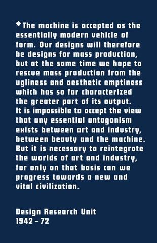
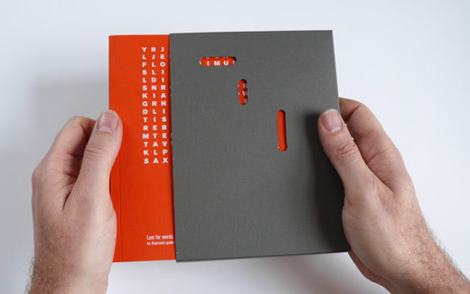
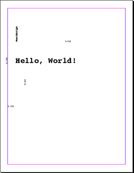
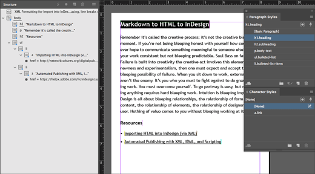
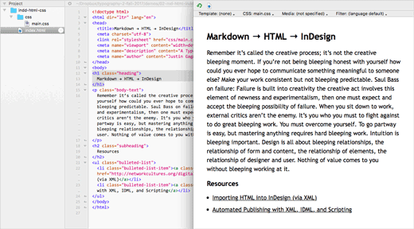
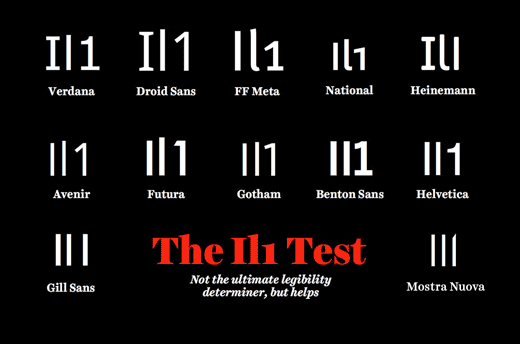

← [`ls`](README.md#lessons)

# Typography 2
## Lesson 2

0. [Preface](#form-follows-content)
1. [Brief](#brief)
2. [Work & Rubric](#work--rubric)
3. [Warm-Up](#warm-up)
3. [Lectures](#lectures)
5. [Schedule](#schedule)
6. [Design Criticism](#design-criticism)
7. [Readings & Resources](#readings--resources)
- [Books](#books)
- [Paper](#paper)
- [Software](#software)

# Form Follows Content



Design Research Unit’s manifesto on the cover of [Michelle Cotton’s monograph](http://apracticeforeverydaylife.com/projects/design-research-unit-1942-72)

> Content precedes design. Design in the absence of content is not design, it’s decoration.
>
> —[Jeffrey Zeldman](http://www.zeldman.com/2012/05/18/web-design-manifesto-2012/), designer, writer, and publisher

> Typographic style is founded not on any one technology of typesetting or printing, but on the primitive yet subtle craft of writing.
>
> —[Robert Bringhurst](https://www.youtube.com/watch?v=oG-oYm1oTLE), poet, typographer and author

> Content is necessary to validate the design process and substantiate the final design. Without content as propellant, the design process descends into the creative pussyfooting and disposable prettiness of the factory of garbage, staffed by the pro-celebrity pop stars who peddle their “one-style-fits-all”, recycled typo-illustration, entirely devoid of meaning and content.
>
> —Simon Kennedy, designer

Manifestos codify beliefs, a set of ideas and goals, published as a manifest or declaration in the form of phrases, paragraphs, and lists that influence the reader to copy, transform, and take action. `#movement`

From hot to cold metal lockup, to photographic and xerographic paste-up, to Bézier curves and PostScript; from paper to screen; to paperless workflows and online publishing with PDF, HTML, and CSS; to the easy-to-read, easy-to-write text-to-HTML formatting syntax of Markdown and the desktop publishing champion InDesign; to the manifestation of human and machine friendly markup and style for printers, screens, and designers alike. The tools and technology of the design industry, past and present, inspire and govern our process and output. How we decide and define the design language, tools, and workflows we use — should be as meaningful as the content and intent in which we design and layout.

## Brief

Revive and layout a manifesto, of your choice, for today’s readers of print and web using a semantic design language, workflow, and a back-to-basics content and structure focused approach to better, more practical, typography.

## Work & Rubric

Copy and paste section into a new `issue` within your repo and title it as *Work & Rubric*. [`#tasklist`](https://github.com/blog/1825-task-lists-in-all-markdown-documents)

### Routine

`20 points`

- [ ] Sketches begin on paper: graph, grid, dot, etc. (capture and document your process)
- [ ] Maintain a repo for this project on GitHub with sketches et al. assets (`.indd`, `.idml`, `.html`, etc.)
- [ ] Use of InDesign and Text Editor (HTML & CSS) for type and layout; Illustrator or Sketch for icons and illustrations; Photoshop for editing photographs and bitmap graphics
- [ ] Use of black only (100% or 4-color black), no grayscale
- [ ] Don’t stretch, compress, or slant fonts `#respectthetype`
- [ ] Don’t mess with lowercase letter-spacing
- [ ] Adjust letter-spacing when setting in all-caps
- [ ] Get your kerning settings right `#metric
- [ ] Use of only free or paid fonts with an EULA stating that web-embedding is allowed `#legalaction`
- [ ] Use of the `@font-face` syntax for embedding web fonts instead of propriety web services syntax from Google Fonts, Adobe Typekit, etc. `#webstandards`

### Details

`20 points`

Format, layout, and production.

- [ ] Single-sheet, 8.5″ × 14″ (legal), landscape orientation, double-sided, folded ([bone folder](https://en.wikipedia.org/wiki/Bone_folder)), 4-page leaflet
  - `#printerspreads`
    ```
    | 4 | 1 |
    |---|---|
    | 2 | 3 |
    ```
  - `#readerspreads`
    ```
    | 1 |
    |---|
    | 2 |
    |---|
    | 3 |
    |---|
    | 4 |
    ```
- [ ] Print on specialty paper stock; color and weight is as meaningful as the content `#intent`
- [ ] InDesign character and paragraph styles must have accurate content-based names and associated class names for HTML/CSS `#semantic`
- [ ] Design for all screen sizes, small (mobile first) to wide (laptop/desktop and print) `#responsive`
  - Single-column layout for small screens and multi-column content-out layout, *let the content decide*, for wider screens (tablet/laptop/desktop) and print `#keepitsimple`

### Typography

`20 points`

Text, scale, and white-space.

- [ ] Select two to three different typefaces or fonts (weights and styles) for typesetting headings, body text, etc.
  - **Reminder:** *All fonts must be legally eligible for web embedding* [You Wouldn’t Think It, But Typeface Piracy Is a Big Problem](https://www.wired.com/2015/10/you-wouldnt-think-it-but-typeface-piracy-is-a-big-problem/)`#honorEULAs`
- [ ] Determine the *sweet spot* body text and line spacing combination, separately, for small screens and print `#paragraphstyles`
- [ ] Based on the two (2) *sweet spot* body text and line spacing combinations, create a responsive typographic modular scale  for headings, body text, small print, etc. both for small screens and print [`#responsivetypesetting`](https://alistapart.com/d/responsive-web-design/ex/ex-article.html)
- [ ] Apply modular scale to layout: spacing between paragraphs and list items, line spacing, line length, page margins, etc.

### Character

`20 points`

Voice, tone, and technic.

- [ ] Believability
- [ ] Consistency
- [ ] Legibility & Readability
- [ ] Harmony

### Best Practices

`20 points`

Clean-up InDesign generated CSS `idGeneratedStyles.css` and save as `main.css`.

- [ ] Format HTML and CSS via [DirtyMarkup](https://dirtymarkup.com)
  - `BBEdit` > `Markup` > `Utilities` > `Format…`
  - `Atom` > `Preferences…` > `Install` (Install Packages) > `atom-beautify`(Search Packages) > `Install`
- [ ] Use CSS shorthand, [Shrthnd](http://shrthnd.volume7.io), for `font`, `margin`, et al. properties for brevity
- [ ] Use `em` values for better web typography; `px` to `em` via [Pixem](http://matthewkosloski.me/labs/pixem/)
- [ ] Validate markup and style using [HTML Validation](https://validator.w3.org) and [CSS Validation](https://jigsaw.w3.org/css-validator/) services

- - -

### Wrap-Up (Extra Credit)

`20 points`



Book and sleeve design by [Tracy Gelder](http://redlegdesign.tumblr.com), graphic designer

- [ ] Design and print a sleeve or envelope for your manifesto leaflet `#totalpackage` `#diecutbyhand` `#differentpaper`
- [ ] Print an edition of 16 leaflets for distribution to colleagues and instructor `#reproduction`
- [ ] Design and link a favicon `.ico` for your manifesto webpage
- [ ] Design and link a Twitter/OG image, 512px × 512px `.png`, for your manifesto webpage

## Schedule

By week, and task(s).

Feel free to copy and paste to make a *Schedule* issue task list (update `- Task` to `- [ ] Task`). [`#tasklist`](https://github.com/blog/1825-task-lists-in-all-markdown-documents)

1. **Ideas, Learn, and Make**
    - Kickoff meeting and lecture
    - Warm-Up
    - Research and work session
    - Meeting and lecture(s)
    - Selected Manifesto authored in Markdown
    - Typographic style tile(s) with selected typefaces
2. **Iterate, Revise, and Repeat**
    - Meeting and lecture(s)
    - Develop and apply responsive typographic modular scale
    - `wip` Draft manifesto typesetting and single-column layout for print and web
    - `wip` Sketches for printed 4-page layout and single-page website
    - `eow` Publish all `wip` files to GitHub
    - `eow` Review and feedback (`1:1` and GitHub comments)
3. **Deliverables, Review, and Takeaways**
    - Revise modular scale and layout(s) after proofing on paper and testing on smartphone and laptop/desktop browsers
    - Publish webpage via GitHub and include the `url` (see [URL Design](https://web.archive.org/web/20170202040319/http://warpspire.com/posts/url-design/)) in your leaflet, ideally in the [colophon](http://www.bookmakingwithkids.com/?p=745) `#backmatter`
    - Production-ready leaflet layout in InDesign and webpage layout in HTML/CSS for final feedback and review
    - Leaflet proofing and printing (at school or a print shop) `#several`
    - `eow` Presentation and review of completed work

*p.s. [Remove the Stress, Pick a Deadline](https://signalvnoise.com/posts/3963-remove-the-stress-pick-a-deadline)*

*p.p.s. [Shrink Your Time](https://gettingreal.37signals.com/ch06_Shrink_Your_Time.php)*

## Warm-Up

`90 minutes`

### Hello, World!



> "Hello, world" is something universal, something bigger. It does not choose color or sex. It does not discriminate any programming language. Balancing the fine line between corny and genius it truly has stood the test of time.
>
> —[*Unsung Heroes of IT / Part One: Brian Kernighan*](http://theunsungheroesofit.com/helloworld/)

> PostScript is a programming language, not really a page description language. By its very nature, it does not provide for really reliable end-to-end workflows since by definition, content can change on the fly. Fun for hackers, disaster for people who need to earn a living.
>
> —[Dov Isaacs](https://www.prepressure.com/postscript/basics/history), Principal Scientist, Adobe Systems Incorporated

> Good design and good markup provide structure to content. Good markup is a fundamental part of good design: beautiful on the inside, beautiful on the outside.
>
> —[Frank Chimero](https://www.frankchimero.com/about/), designer, writer, and illustrator

### Instructor

`60 minutes`

1. As a class, watch [“Get Uncomfortable” by Stephen Hay](https://creativemornings.com/talks/stephen-hay/1) `video`
2. Discuss, demo, and compare markup languages for print and web design, the evolution of page description to plain text, and the benefits of separating presentational and structural semantics for better accessibility and readability
    - Present `02-hello-world-ps-layout.eps` as an example of layout in a text editor and a browser using PostScript (see `/warm-ups/02-hello-world-ps-layout/` for reference)
3. Demo how to extend BBEdit’s support for PostScript syntax highlighting and MD to HTML conversion
4. Demo how to author, view, and save a `Hello, World!` example in PS, SVG, MD, and HTML/CSS

### Student(s)

`30 minutes`

1. Author, view, and save a simple `Hello, World!` example in PS, SVG, MD, and HTML/CSS
2. Save `.ps` as `.eps` and open within Illustrator and inspect each text node
   - PostScript is still the underlying language behind Illustrator. We just set type by hand using a text editor, like you would in Illustrator or InDesign, but without the GUI WYSIWYG tools
3. Place `.eps` in InDesign and inspect each text node
    - What happens? Why? `#discussion`
4. Open *And Per Sketch* ampersand sketch grid `.indd` (from Lesson 1) and save as `.idml`
5. Open `.idml` in a text editor; check out the `Stories` folder and the accessible content and readable format of `.xml`
6. Open `.svg` example in Illustrator and inspect
   - SVG is an XML-based open web standard for vector images on the web; developed by the World Wide Web Consortium (W3C) since 1999
   - Caveat: InDesign doesn’t support SVG (import or export). `#thanksadobe` `#eps`
7. Make a new repo for this exercise with a `README.md` listing a comparison of `Hello, World!` code blocks in each markup language
8. Publish via GitHub

> Most proprietary DTP programs store data in binary file formats that can’t be read by most human beings. Some even encrypt their files to make sure that sure you can only access your work with their closed software. If such a file has been damaged, it’s close to impossible to repair it.
>
> [Because your data belongs to YOU](https://www.scribus.net/because-your-data-belongs-to-you/)

### Page Description to Plain Text

- PS, [PostScript](https://en.wikipedia.org/wiki/PostScript)
- SVG, [Scalable Vector Graphics](https://www.w3.org/TR/SVG11/)
- MD, [Markdown](https://daringfireball.net/projects/markdown/)
- HTML and CSS, [Hypertext Markup Language](https://www.w3.org/TR/html51/) and [Cascading Style Sheets](https://www.w3.org/TR/CSS21/)

### Install

Extras for BBEdit:

- Language Module: `PostScript.plist`
  - `~/Library/Application Support/BBEdit/Language Module/`
- Text Filters: `md → html.pl`
  - `~/Library/Application Support/BBEdit/Text Filters/`

## Lectures

*Not all lectures take place in class; some video lectures get assigned as homework.*



Markdown to HTML to InDesign Workflow `#import`

1. [**A History of Graphic Design Production**](http://www.graphicmeans.com) `video` `#discussion`
2. [**Do We Need to Write Markup?** by Nathan Ford](http://artequalswork.com/posts/markup/) `video` `#first34m` `#discussion`
3. [**Designing in the Browser** by Stephen Hay](https://vimeo.com/120372264) `video` `#discussion`
4. [**More Perfect Typography** by Tim Brown](https://vimeo.com/17079380) `video` `#discussion`
5. [**Typesetting Body Text** by Tim Brown](https://vimeo.com/156203722) `video` `#demo`
6. **Choosing and Using Web Fonts** `#reference` [*Web Typography* by Richard Rutter](http://www.book.webtypography.net)
7. **Content First Design, Content Out Layout, and Breakpoints**
8. **MD → HTML → InDesign Workflow, Semantic Content, Markup & Style, and Naming Things is Hard** (see `/demos/02-md-html-indd-workflow/` for reference) `#demo`



InDesign to HTML and CSS Workflow `#export`

### MD → HTML → InDesign → HTML and CSS: A Typesetting and Publishing Workflow for Print and Web
- Prepping, converting, and importing MD to XML to InDesign
- Benefitting from semantic markup and style through meaningful terminology, and naming conventions
- Mapping HTML inline (text) and block (sections, grouping, etc.) elements to InDesign Character and Paragraph Styles
- Exporting InDesign to HTML and CSS
- Cleaning up InDesign generated HTML and CSS for better readability and web typography

## Design Criticism

*Please skim before attending design critiques.*

- [Cut the Shit Sandwich](http://muledesign.com/2017/05/cut-the-shit-sandwich)
- [Finding the Positive in Negative Feedback](https://deardesignstudent.com/finding-the-positive-in-negative-feedback-8f7dfa2b7da5)
- [Design Criticism and the Creative Process](https://alistapart.com/article/design-criticism-creative-process)
- [Sharing Our Work: Testing and Feedback in Design](https://alistapart.com/article/sharing-our-work-testing-feedback-in-design)

## Readings & Resources

Copy and paste section into a new `issue` within your repo and title it as *Readings & Resources*. [`#tasklist`](https://github.com/blog/1825-task-lists-in-all-markdown-documents)

**Note:** Prefixed `[ ] →` links are required reading (or viewing). `#readme`

### Manifestos

- [ ] → [Manifesto](http://www.manifestoproject.it)
- [ ] → [Manifesto Mania](http://www.aiga.org/manifesto-mania)
- [ ] → [Designers do bite back. Here come the Manifestos!](http://wordsfordesigners.com/2017/01/designers-do-bite-back-here-come-the-manifestos/)
- [ ] → [First Things First Manifesto 2000](http://www.eyemagazine.com/feature/article/first-things-first-manifesto-2000)
- [100+ Years of Design Manifestos](http://backspace.com/notes/2009/07/design-manifestos.php) `#2014`
- [ ] → [Web Design Manifesto 2012](http://www.zeldman.com/2012/05/18/web-design-manifesto-2012/)
- [The Open Web Design Manifesto](http://blog.froont.com/manifesto/)
- [10 Rules for Students, Teachers, and Life by John Cage and Sister Corita Kent](https://www.brainpickings.org/2012/08/10/10-rules-for-students-and-teachers-john-cage-corita-kent/)

### Influence

- [ ] → [Design Research Unit, 1942–1972](http://apracticeforeverydaylife.com/projects/design-research-unit-1942-72)
- [8vo: type and structure](http://www.eyemagazine.com/feature/article/8vo-type-and-structure)
- [Graphic Design Manifestos Revisited](http://www.amalieborghansen.com/graphic-design-manifestos-revisited)
- [INtroducing IN-Pratica: The Italian Design Manifesto](http://www.printmag.com/design-culture-2/italian-design-manifesto/)
- [The Labour Party Manifesto 2017](http://www.labour.org.uk/index.php/manifesto2017)
- [ ] → [*Design and the Play Instinct* by Paul Rand](http://www.paul-rand.com/foundation/thoughts_designAndthePlayInstinct/)
- [Baseline Magazine](http://blog.baselinemagazine.com) `blog`

### Content-Based Layout

- [ ] → [Content-out Layout](https://alistapart.com/article/content-out-layout)
- [A New Canon](http://www.markboulton.co.uk/journal/anewcanon)
- [ ] → [Content First Web Design: What It’s About and How to Get Started](https://blogs.adobe.com/creativecloud/content-first-web-design-what-its-about-and-how-to-get-started/)

### Style Tiles

- [Style Tiles and How They Work](https://alistapart.com/article/style-tiles-and-how-they-work)

### Choosing Fonts

- [ ] → [Choosing the Right Type](http://jessicahische.is/talkingtype) `#scrolldown`
- [ ] → [Finding Fonts – A Guide](http://learn.scannerlicker.net/2017/08/02/finding-fonts-a-guide/)
- [Selecting Typefaces for Body Text](https://practice.typekit.com/lesson/selecting-typefaces-for-body-text/)
- [On Choosing Type](http://ilovetypography.com/2008/04/04/on-choosing-type/)
- [What Font Should I Use? 5 Principles for Choosing and Using Typefaces](https://www.smashingmagazine.com/2010/12/what-font-should-i-use-five-principles-for-choosing-and-using-typefaces/)

### Combining Fonts

- [ ] → [Four Techniques for Combining Fonts](https://www.typography.com/techniques/)
- [ ] → [How to Use Clashing Fonts](https://www.typography.com/blog/fonts-that-clash)
- [Typographic Doubletakes](https://www.typography.com/blog/typographic-doubletakes)

### Body Text Sizing

- [ ] →  [How We Learned to Leave Default `font-size` Alone and Embrace the `em`](https://www.filamentgroup.com/lab/how-we-learned-to-leave-body-font-size-alone.html)
- [ ] →  [CSS Font Sizing](https://bitsofco.de/css-font-sizing/)
- [ ] →  [“More Perfect Typography” by Tim Brown](https://vimeo.com/17079380) `video`
- [ ] →  [“Typesetting Body Text” by Tim Brown](https://vimeo.com/156203722) `video`

### Legibility & Readability

- [ ] → [How We Read](https://alistapart.com/article/how-we-read)
- [ ] → [On Legibility – In Typography And Type Design](http://learn.scannerlicker.net/2014/11/14/on-legibility-in-typography-and-type-design/)
- [ ] → [A study in typographic accessibility from Fontsmith](http://www.typographher.com/blog/2016/10/6/a-study-in-typographic-accessibility-from-fontsmith?rq=legibility)
- [Legibility and Readability](http://smad.jmu.edu/shen/webtype/read.html)
- [The 'Il1' Test](https://codepen.io/thedigitalman/details/XmGaEM)



Does your site’s font pass the “il1” test? More insights on type from [Jessica Hische](http://jessicahische.is/talkingtype)

### Practical Typography for Print & Web

- [ ] → [“On Web Typography” by Jason Santa Maria](https://vimeo.com/34178417) `video`
- [ ] → [Web Typography Overview](http://smad.jmu.edu/shen/webtype/)
- [ ] → [Butterick’s Practical Typography](http://practicaltypography.com)
- [ ] → [The Elements of Typographic Style Applied to the Web](http://webtypography.net/intro/)
- [Typography Handbook](http://typographyhandbook.com)
- [Professional Web Typography](https://prowebtype.com)

### Web Fonts & Tools

- [Google Fonts](https://fonts.google.com)
- [Font Squirrel](https://www.fontsquirrel.com)
- [Typography Supply: An Inventory of Typographic Tools](http://typography.supply)
- [Webfont Generator](https://www.fontsquirrel.com/tools/webfont-generator)
- [Webfont Test: Test up to three fonts](http://webfont-test.com)
- [Web Font Test Tool](http://www.impallari.com/testing/)

### Font Formats

- [Font Format](http://smad.jmu.edu/shen/webtype/format.html) Pre WOFF2 and Variable TTF and WOFF2 variations
- [WOFF 2.0 - Web Open Font Format ](http://caniuse.com/#feat=woff2) TrueType/OpenType font that provides better compression than WOFF 1.0
- [ ] → [Variable Fonts: the Future of (Web) Type](http://typographica.org/on-typography/variable-fonts/)
- [Welcome to Variable Fonts!](https://type.today/en/journal/opentype_variables)

### Typographic Scale

- [More Meaningful Typography](https://alistapart.com/article/more-meaningful-typography)
- [Don’t Compose Without a Scale](http://webtypography.net/3.1.1)
- [ ] → [A More Modern Scale for Web Typography](http://typecast.com/blog/a-more-modern-scale-for-web-typography)
- [The Typographic Scale](http://spencermortensen.com/articles/typographic-scale/)
- [Modular Scale](http://www.modularscale.com)

### Typographic Details

- [ ] → [Finely tuned typography: sweating the small stuff](http://www.monotype.com/resources/webinars/finely-tuned-typography-sweating-the-small-stuff/)

### Formatting Lists

- [ ] → [Bulleted and Numbered Lists](http://practicaltypography.com/bulleted-and-numbered-lists.html)
- [Create Bulleted or Numbered Lists](https://helpx.adobe.com/indesign/using/bullets-numbering.html)
- [Formatting Tips for Bullets and Numbered Lists](https://indesignsecrets.com/formatting-tips-bullets-numbered-lists.php)

### InDesign Tutorial & Tools

- [InDesign Tutorials](https://helpx.adobe.com/indesign/tutorials.html)
- [TypeEd](https://type-ed.com/search?q=indesign)
- [InDesign CC Visual Quickstart Guide (2014)](http://ptgmedia.pearsoncmg.com/images/9780321929570/samplepages/0321929578.pdf) `pdf`
- [MultiDo](https://www.65bit.com/software/easyhistory/) Free `Edit` > `Undo` & `Redo` Plug-in

### MD → HTML → InDesign Workflow

- [From Word to Markdown to InDesign](http://rhythmus.be/md2indd/)
- [ ] → [Importing HTML into InDesign (via XML)](http://networkcultures.org/digitalpublishing/2014/05/15/import-html-into-indesign-via-xml/)
- [Digital Publishing Toolkit](https://github.com/DigitalPublishingToolkit)

### Markdown

- [ ] → [Mastering Markdown](https://guides.github.com/features/mastering-markdown/)
- [ ] → [Markdown Cheatsheet](https://github.com/tchapi/markdown-cheatsheet)
- [HackMD](https://hackmd.io/) Write and Share Your Knowledge in Markdown
- [Markdown Quiz](http://www.markdownquiz.com)

### HTML & CSS Semantics

- [ ] → [Semantic Content Markup](http://webstyleguide.com/wsg3/5-site-structure/2-semantic-markup.html)
- [ ] → [Naming CSS Stuff Is Really Hard](https://seesparkbox.com/foundry/naming_css_stuff_is_really_hard)
- [HTML5 Element Index](http://html5doctor.com/#glossary)
- [The Book](http://www.shadycharacters.co.uk/books/the-book) `#buyme`
- [W3C HTML Checker](https://validator.w3.org/nu/) Validate markup and check document outline
- [W3C CSS Checker](https://jigsaw.w3.org/css-validator/)

### Markup & Style Standards Guides

- [ ] → [Code Guide: Standards for developing flexible, durable, and sustainable HTML and CSS](http://codeguide.co)
- [Style Manual ](http://stylemanual.org)

### Accessibility

- [ ] → [The Accessibility Cheatsheet](https://bitsofco.de/the-accessibility-cheatsheet/)

### PostScript

- [ ] → [Postscript and Geometry](http://merganser.math.gvsu.edu/david/psseminar/)
- [A First Guide to PostScript](http://www.tailrecursive.org/postscript/postscript.html)
- [ ] → [The History of PostScript](https://www.prepressure.com/postscript/basics/history)
- [ ] → [Adobe Co-founder John Warnock on the Competitive Advantages of Aesthetics and the ‘Right’ Technology](http://knowledge.wharton.upenn.edu/article/adobe-co-founder-john-warnock-on-the-competitive-advantages-of-aesthetics-and-the-right-technology/)
- [Adobe PostScript: The Language of Business](https://www.youtube.com/watch?v=Ayb-KF32uWk) `video`

### PDF

- [ ] → [Hello World](https://www.adobe.com/content/dam/Adobe/en/technology/pdfs/Future_of_PDF_Flash.pdf) (see pg. 7–12) `pdf`
- [ ] → [Introducing Next-Generation PDF (Keynote)](https://www.pdfa.org/slides-and-video-recordings-of-the-pdf-days-europe-2017/) `video`

### Hot Metal Type

- [ ] → [The End of an Era: A Short Film About The Last Day of Hot Metal Typesetting at The New York Times (1978)](http://www.openculture.com/2015/08/the-end-of-an-era-a-short-film-about-the-last-day-of-hot-metal-typesetting-at-the-new-york-times-1978.html) `video`
- [ ] → [1966–2016 | The Last Hot-Type Printer Puts Down His Tools](https://www.nytimes.com/2016/06/02/insider/1966-2016-the-last-hot-type-printer-puts-down-his-tools.html)

## Books

- [Web Typography](http://www.book.webtypography.net) `#buyme`
- [On Web Typography](https://abookapart.com/products/on-web-typography)
- [Inside Paragraphs: Typographic Fundamentals](http://insideparagraphs.com)
- [Butterick’s Practical Typography](http://practicaltypography.com) `#donate`
- [Explorations in Typography (Second Edition)](http://explorationsintypography.com)
- [Responsive Web Design (Second Edition)](https://abookapart.com/products/responsive-web-design)
- [HTML5 for Web Designers (Second Edition)](https://abookapart.com/products/html5-for-web-designers)

## Paper

- [French Paper Co.](http://www.frenchpaper.com)
- [French Paper Utility Guide](http://www.frenchpaper.com/utility-guide.html) `#2dollars` `#buyme`
- [Neenah Fine Papers](http://www.neenahpaper.com/finepaper)
- [Neenah Class Crest Papers](http://www.neenahpaper.com/finepaper/classiccrestpapers/productdetail?type=sample&color=Solar%20White&finish=Smooth) `#ordersamples`
- [Neenah Color Copy Papers](http://www.neenahpaper.com/finepaper/morebrands/neenahcolorcopy/productdetail?color=Solar+White&finish=Super+Smooth) `#ordersamples`

## Software

### Text Editor

Pick a *free* flavor…

- [Atom](https://atom.io)
- [BBEdit](http://www.barebones.com/products/bbedit/) (Mac only)
- [Brackets](http://brackets.io)
- [HTML Builder Prototype](http://dev.artequalswork.com/builder/)

### Favicon Generator

- [ICO converter](https://www.icoconverter.com)

### Digital & Icon Design

- [Illustrator](https://www.adobe.com/products/illustrator.html)
- [Sketch](https://www.sketchapp.com)

### Print Design & Layout

- [InDesign](https://www.adobe.com/products/indesign.html)
