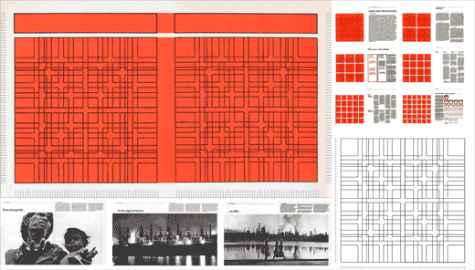
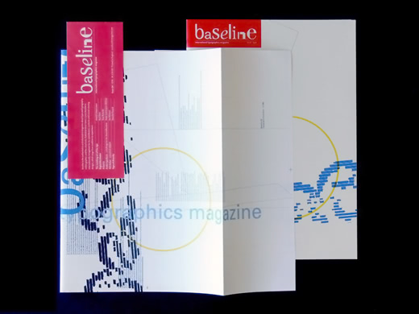
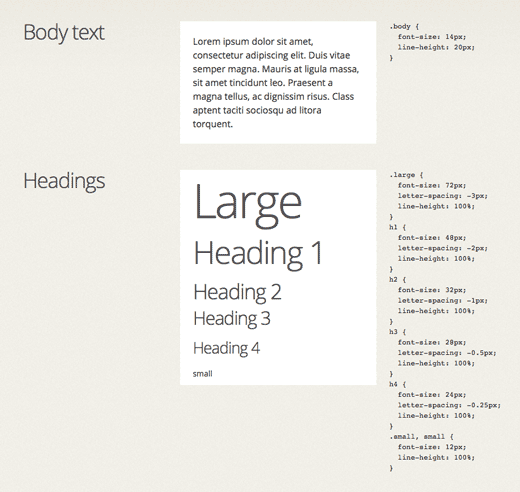

← [`ls`](README.md#lessons)

# Typography 2
## Lesson 4

0. [Preface](#details--summary)
1. [Brief](#brief)
2. [Work & Rubric](#work--rubric)
3. [Warm-Up](#warm-up)
3. [Lectures](#lectures)
5. [Schedule](s)
6. [Readings & Resources](#readings--resources)
- [Books](#books)
- [Magazines](#magazines)
- [Software](#software)

# Details & Summary

Karl Gerstner’s [modular grid for Capital magazine](http://thinkingform.com/2011/11/28/thinking-capital-magazine-no1-designed-by-karl-gerstner/), 1962

> Readers want what is important to be clearly laid out; they will not read what is too troublesome.
>
> —[Jan Tschichold](http://retinart.net/graphic-design/clarity-demanded-the-modernists/), calligrapher, typographer, and book designer

> Every part of a text relates to every other part by a definite, logical relationship of emphasis and value, predetermined by content. It is up to the typographer to express this relationship clearly and visibly through type sizes and weight, arrangement of lines, use of color, photography, etc.
>
> —[Jan Tschichold](http://retinart.net/graphic-design/clarity-demanded-the-modernists/), calligrapher, typographer, and book designer

> The details are not the details. They make the design.
>
> —[Charles Eames](http://www.eamesoffice.com/the-work/design-q-a/), designer

Detailed typographic structure and style adds visual and cognitive clarity through the use of hierarchy, contrast, and white-space. Design for the reader, not the designer.

## Brief

Design a multi-page print magazine and companion single or multi-page website with `tl;dr`, ‘too long; didn’t read’ as the central theme for structuring, navigating, and laying out a full and quick read of the content of your choice. `#redesign`

> To be a good typographer you have to care about language.
>
> —[Simon Johnston](http://www.simonjohnstondesign.com), designer and educator

Choose content that speaks to you — content that you care about. An exhibition catalog, a single-subject digest (see [A Book Apart Briefs](https://abookapart.com/collections/briefs-collection)), or any other collection of content with plenty of text to be unavoidable and enough image to be agreeable.

## Work & Rubric

Copy and paste section into a new `issue` within your repo and title it as *Work & Rubric*. [`#tasklist`](https://github.com/blog/1825-task-lists-in-all-markdown-documents)

> The process of design starts with exploration, but ends with refinement. The best designers carefully move from one to the other, making sure they spend enough time exploring before locking themselves into a design approach.
>
> —[Jared Spool](http://centercentre.com/about/jared-spool), usability expert

### Routine

`20 points`

- [ ] Sketches begin on paper: graph, grid, dot, etc. (capture and document your process)
- [ ] Maintain a repo for this project on GitHub with sketches et al. assets (`.indd`, `.idml`, `.html`, etc.)
- [ ] Use of InDesign and Text Editor (HTML & CSS) for type and layout; Illustrator or Sketch for icons and illustrations; Photoshop for editing photographs and bitmap graphics
- [ ] Use of black (100% or 4-color black), grayscale, and  full-color CMYK
- [ ] Don’t stretch, compress, or slant fonts `#respectthetype`
- [ ] Don’t mess with lowercase letter-spacing
- [ ] Adjust letter-spacing when setting in all-caps
- [ ] Get your kerning settings right `#metric
- [ ] Use of only free or paid fonts with an EULA stating that web-embedding is allowed `#legalaction`
- [ ] Use of the `@font-face` syntax for embedding web fonts instead of propriety web services syntax from Google Fonts, Adobe Typekit, etc. `#webstandards`

### Content

`20 points`

- [ ] At least 500 words unabridged (full read) and fewer than 200 words abridged (quick read)
- [ ] Inclusion of imagery: photographs, illustrations, charts, etc.
- [ ] Provide navigation; skip to instruction (print) and link (web), or an obvious way to jump to either the full or quick read or vice versa.
- [ ] Provide an About section or page with a colophon and link to the style guide

### Details

`20 points`

Format, layout, and production.

- [ ] Multi-sheet, 13″ × 19″ or larger, double-sided, folded ([bone folder](https://en.wikipedia.org/wiki/Bone_folder)), saddle-stapled (booklet), full-color CMYK. `#output` `#options`
  - Color laser photocopier/printer @ local/nearest print shop
    -  Printing without a bleed: 13″ × 19″ is the maximum paper size when printing through the manual bypass tray of most production color photocopiers/printers
    - Print with a bleed: 13″ × 19″ is the max paper size, but the max printing size, including bleed, is 12.5″ × 18.5″ with a final trim size of 12″ × 18″
    - Consider avoiding bleeds for a maximum paper size
  - Broadsheet and tabloid newsprint printing
    - [Newspaper Club](https://www.newspaperclub.com/choose)
  - Magazine Print-On-Demand (POD) vendors
    - [PrintNinja](http://www.printninja.com/pricing/magazines)
- [ ] InDesign character and paragraph styles must have accurate content-based names and associated class names for HTML/CSS `#semantic`
- [ ] Strict usage of style guide for color, typography, imagery, and navigation/links coherency and consistency
- [ ] Design for all screen sizes, small (mobile first) to wide (laptop/desktop and print) `#responsive`
  -  Single-column layout for small screens and multi-column content-out layout, *let the content decide*, for wider screens (tablet/laptop/desktop) and print `#keepitsimple`

### Typography

`20 points`

Text, scale, and white-space.

- [ ] Select two to three different typefaces or fonts (weights and styles) for typesetting headings, body text, etc.
  - **Reminder:** *All fonts must be legally eligible for web embedding* `#honorEULAs`
- [ ] Determine the *sweet spot* body text and line spacing combination, separately, for small screens and print `#paragraphstyles`
- [ ] Based on the two (2) *sweet spot* body text and line spacing combinations, create a responsive typographic modular scale  for headings, body text, small print, etc. both for small screens and print `#realcontent`
- [ ] Apply modular scale to layout: spacing between paragraphs and list items, line spacing, line length, page margins, etc.

### Best Practices

`20 points`

Clean-up InDesign generated CSS `idGeneratedStyles.css` and save as `main.css`.

- [ ] Format HTML and CSS via [DirtyMarkup](https://dirtymarkup.com)
  - `BBEdit` > `Markup` > `Utilities` > `Format…`
  - `Atom` > `Preferences…` > `Install` (Install Packages) > `atom-beautify`(Search Packages) > `Install`
- [ ] Use CSS shorthand, [Shrthnd](http://shrthnd.volume7.io), for `font`, `margin`, et al. properties for brevity
- [ ] Use `em` values for better web typography;`px` to `em` via [Pixem](http://matthewkosloski.me/labs/pixem/)
- [ ] Validate markup and style using [HTML Validation](https://validator.w3.org) and [CSS Validation](https://jigsaw.w3.org/css-validator/) services

- - -

### Wrap-Up (Extra Credit)

`20 points`

[Early Baseline magazine](http://blog.baselinemagazine.com/baseline/looking-back-at-baseline-17-31/) featuring the first wrap around jacket/poster

- [ ] Design and print a wrap around jacket/poster for your magazine `#specialtypaper` `#vellum` `#mylar`
- [ ] Print a small edition of six (6) magazines for distribution `#reproduction`
- [ ] Design and link a favicon `.ico` for your companion webpage
- [ ] Design and link a Twitter/OG image, 512px × 512px `.png`, for your companion webpage

## Schedule

By week, and task(s).

Feel free to copy and paste to make a *Schedule* issue task list (update `- Task` to `- [ ] Task`). [`#tasklist`](https://github.com/blog/1825-task-lists-in-all-markdown-documents)

1. **Ideas, Learn, and Make**
    - Kickoff meeting and lecture
    - Warm-Up
    - Research and work session
    - Meeting and lecture(s)
    - Selected content authored in Markdown
    - Typographic style tile(s) with selected typefaces
2. **Iterate, Revise, and Repeat**
    - Meeting and lecture(s)
    - Develop and apply responsive typographic modular scale
    - `wip` Draft magazine typesetting and single-column layout for print and web
    - `wip` Sketches for printed layout and single or multi-page website
    - `eow` Print and make a [folding dummy](https://www.designersinsights.com/designer-resources/understanding-and-working-with-print/) of `wip` magazine layout
    - `eow` Publish all `wip` files to GitHub
    - `eow` Review and feedback (`1:1` and GitHub comments)
3. **Deliverables, Review, and Takeaways**
    - Revise modular scale and layout(s) after proofing on paper and testing on smartphone and laptop/desktop browsers
    - Publish webpage via GitHub and include the `url` (see [URL Design](https://web.archive.org/web/20170202040319/http://warpspire.com/posts/url-design/)) in your magazine, ideally in the [colophon](http://www.bookmakingwithkids.com/?p=745) `#backmatter`
    - Production-ready magazine layout in InDesign and webpage layout in HTML/CSS for final feedback and review
    - Magazine proofing and printing (at school or a print shop) `#printafew`
    - `eow` Presentation and review of completed work

## Warm-Up

`90 minutes`

## Style (Sheet) Guide

Type sizes from [Mozilla’s Style Guide](https://www.mozilla.org/en-US/styleguide/websites/sandstone/typefaces/)

> Want to grow as a designer? Spend most of your time thinking about how it works, as opposed to how it looks.
>
> —[Josh Puckett](https://dribbble.com/joshpuckett), designer

### Details

Develop a style guide for color, typography, imagery, and navigation/links patterns and usage.

1. Working with only the quick read version of your content, text and image; develop a series of style tiles in print or web, your preference to start, exploring the following:
    - **Color Palette**
      - Develop an A11Y friendly color palette
      - Include at least one (1) primary color and one (1) accent color, other than black and functional grays
    - **Typography**
      - Match, closely match, or update the primary font(s) for body text and headings, ensuring that typography is consistent in print and web
      - Select a secondary web safe font for captions and small print, or even to replace body text
      - Develop a basic modular scale for body text and headings
    - **Imagery**
      - Photograph or detailed illustration sources should be of notable quality, retina (2x) and non-retina (1x)
      - Line art and simple solid color illustration sources should be available, prepared, or redrawn as vector `#svg`
      - Sources must be cited with a canonical reference and link
      - Develop and structure and style for an image; an image with a caption; a heading, an image with a caption, and a paragraph
    - **Navigation & Links**
      - Develop a structure and style for navigation and links, providing users with seamless navigation to content
2. Print and test patterns on paper and screen
3. Design and develop a web-based style guide by combining each style title into a cohesive work in progress guide for typographic structure and style.
    - Publish via GitHub
    - Maintain and update repo; commit updates as you work

## Lectures

> We’re not designing pages, we’re designing systems of components.
>
> —[Stephen Hay](http://www.the-haystack.com)

1. **Typographic Editorial Design Survey**
    - Discuss past and present day structure and style of typographic editorial design
      - [Emigre](http://www.emigre.com/EMagView.php) magazine, was published between 1984 and 2005
      - [Octavo](http://www.hamishmuir.com/octavo.html), International Journal of Typography, was published between 1986 and 1992
      - [Grafik](https://www.grafik.net), was published between 2003 and 2011; currently published exclusively on the web
      - [Baseline](http://www.baselinemagazine.com/about_contact/history_and_awards/), International TypoGraphics Magazine, in print since 1979
      - [Eye](http://www.eyemagazine.com) Magazine, The International Review of Graphic Design, in print since 1990
      - [Codex](http://codexmag.com/about/), The Journal of Typography, was published between 2011 and 2014
      - [Typenotes](https://shop.fontsmith.com), A Journal Dedicated to Typography and Graphic Design, in print since 2017
      - [Typographics](http://www.typographics.org), The Magazine for Type People, in print since 2017
2. **Design Systems: Principles, Patterns, and Style Guides**
    - Discuss and demonstrate how design principles, patterns, and style guides are part of the design process, not an endnote
      - [Agile Publishing](http://go.monotype.com/Video_Agile-Publishing-THX.html) `video`
      - [“The Map & The Territory” by Ethan Marcotte](https://vimeo.com/120164988) `video`
      - [Design Systems](http://atomicdesign.bradfrost.com/chapter-1/), Chapter 1 of *Atomic Design* by Brad Frost
      - [BDConf: Stephen Hay presents Responsive Design Workflow](http://bradfrost.com/blog/mobile/bdconf-stephen-hay-presents-responsive-design-workflow/)
3. **Improving Your InDesign Workflow**
    - Discuss and demonstrate how the Book feature combined with scripts in InDesign can assist, automate, and improve your design workflow.
4. **Writing for Web and Mobile**
    - [“Content First!” by Jeffrey Zeldman](https://vimeo.com/70977623) `video`
    - Discuss and demonstrate how to better write for writing for web and mobile using strategies from Stephanie Hay (Content Strategist) and Jakob Nielsen (Usability Expert)

## Readings & Resources

Copy and paste section into a new `issue` within your repo and title it as *Readings & Resources*. [`#tasklist`](https://github.com/blog/1825-task-lists-in-all-markdown-documents)

**Note:** Prefixed `[ ] →` links are required reading (or viewing). `#readme`

### Too Long; Didn’t Read

- [ ] → [Short and shallow reading on the Internet? Not so fast](http://www.pbs.org/newshour/bb/short-and-shallow-reading-on-the-internet-not-so-fast/) `video`
- [ ] → [Long vs. Short Articles as Content Strategy](https://www.nngroup.com/articles/content-strategy-long-vs-short/)
- [ ] → [Legibility, Readability, and Comprehension: Making Users Read Your Words](https://www.nngroup.com/articles/legibility-readability-comprehension/)
- [ ] → [Designing for Split-Second Clarity](http://go.monotype.com/Video_Legibility-THX.html) `video`
- [ ] → [Anchors OK? Re-Assessing In-Page Links](https://www.nngroup.com/articles/in-page-links/)
- ["Skip Navigation" Links](http://webaim.org/techniques/skipnav/)
- [Automatic Text Summarizer](http://autosummarizer.com)

### Writing

- [ ] → [*Lean Content* by Stephanie Hay](https://www.youtube.com/watch?v=g2QO9nZUVk4&feature=youtu.be) `video`
- [ ] → [Be Succinct! (Writing for the Web)](https://www.nngroup.com/articles/be-succinct-writing-for-the-web/)
- [Writing for the Web](https://www.usability.gov/how-to-and-tools/methods/writing-for-the-web.html)
- [Reading Content on Mobile Devices](https://www.nngroup.com/articles/mobile-content/)
- [Keep it short (but not too short)](http://www.learnnc.org/lp/editions/webwriting/708)
- [Voice and Tone](http://styleguide.mailchimp.com/voice-and-tone/)
- [Measure Text Readability](https://readable.io/text/)
- [Hemingway Editor](http://www.hemingwayapp.com)
- [Nitpicker](http://nitpickertool.com)

### Single-Tasking

- [ ] → [Infomagical: Bootcamp](http://www.wnyc.org/story/infomagical-bootcamp) `audio`
- [Information Overload And The Tricky Art Of Single-Tasking](http://www.npr.org/sections/alltechconsidered/2016/02/11/466177618/information-overload-and-the-tricky-art-of-single-tasking)

### Design Process

- [ ] → [Agile Publishing](http://go.monotype.com/Video_Agile-Publishing-THX.html) `video`
- [ ] → ["Anatomy of a Design Decision" by Jared Spool](https://vimeo.com/20881152) `video`

### Influence

- [ ] → [The New Web Typography](https://robinrendle.com/essays/new-web-typography/)
- [ ] → [Paul Rand Discusses Typography](https://www.youtube.com/watch?v=r9Bi5dC2Zjg) `video`
- [ ] → [The Form of the Book*, Digested](http://artequalswork.com/posts/form-of-the-book/)
- [ ] → [Tschichold, Dwiggins, Muller-Brockmann and “The Grid”](http://timbroadwater.com/2014/05/tschichold-dwiggins-muller-brockmann-and-the-grid/)
- [Programme as Grid](https://www.rototype.org/projektiranje/en/gerstner-3/)
- [ ] → [Frameworks](https://alistapart.com/article/frameworks)
- [ ] → [“Resilience” by Jeremy Keith](https://vimeo.com/166140718) `video`
- [ ] → [Resilience](https://adactio.com/articles/11481)
- [The Road To Resilient Web Design](https://www.smashingmagazine.com/2017/03/resilient-web-design/)
- [ ] → [*Resilient Web Design* by Jeremy Keith](https://resilientwebdesign.com) `#futureofpublishing`
- [Hack the Cover](https://craigmod.com/journal/hack_the_cover/)
- [ ] → [Let’s Talk About Margins](https://craigmod.com/sputnik/lets_talk_about_margins/)
- [Post-Artifact Books and Publishing](https://craigmod.com/journal/post_artifact/)
- [Future Reading](https://aeon.co/essays/stagnant-and-dull-can-digital-books-ever-replace-print)
- [ ] → [Is anybody out there reading?](http://www.eyemagazine.com/review/article/is-anybody-out-there-reading)
- [Lessons From Swiss Style Graphic Design](https://www.smashingmagazine.com/2009/07/lessons-from-swiss-style-graphic-design/)
- [What I learned from the $2,000 elusive design book “Designing Programmes”](https://medium.muz.li/what-i-learned-from-the-2-000-elusive-design-book-designing-programmes-f518faefcf4b)
- [Thinking Capital magazine No:1 designed by Karl Gerstner](http://thinkingform.com/2011/11/28/thinking-capital-magazine-no1-designed-by-karl-gerstner/)
- ['Intro' from 'Issue N°3 — Karl Gerstner's Capital' by Flat File](https://readymag.com/flatfile/03-capital/)
- [*Designing Programmes*, Digested](http://artequalswork.com/posts/designing-programmes/)
- [The designer as Programmer](http://www.eyemagazine.com/review/article/the-designer-as-programmer)
- [In Memoriam: Karl Gerstner (1930-2016)](http://www.typeroom.eu/article/memoriam-karl-gerstner-1930-2016)
- [Celebrating Karl Gerstner](https://medium.com/@bryanarchy/celebrating-karl-gerstner-b0ffbcf65c96)

### Style and Pattern Guides

- [ ] → [I Made a Style Guide for My Personal Web Site and You Should Too](https://www.zachleat.com/web/now-with-style-guide/?utm_source=CSS-Weekly&utm_campaign=Issue-278&utm_medium=web)
- [ ] → [Airbnb Building a Visual Language](https://airbnb.design/building-a-visual-language/)
- [ ] → [BBC Global Experience Language](http://www.bbc.co.uk/gel)
- [ ] → [USPS Style Guide](https://www.usps.com/styleguide/design/)
- [ ] → [A Pattern Apart](http://patterns.alistapart.com)
- [Website Style Guide Resources](http://styleguides.io)

### Color Contrast

- [ ] → [What is Color Contrast?](http://a11yproject.com/posts/what-is-color-contrast/)
- [Color Accessibility Workflows](https://alistapart.com/article/color-accessibility-workflows)
- [Color Safe](http://colorsafe.co)
- [WebAIM: Color Contrast Checker](http://webaim.org/resources/contrastchecker/)
- [Colour Contrast Analyser](https://www.paciellogroup.com/resources/contrastanalyser/)

### Legibility & Readability

- [ ] → [How We Read](https://alistapart.com/article/how-we-read)
- [ ] → [On Legibility – In Typography And Type Design](http://learn.scannerlicker.net/2014/11/14/on-legibility-in-typography-and-type-design/)
- [ ] → [A study in typographic accessibility from Fontsmith](http://www.typographher.com/blog/2016/10/6/a-study-in-typographic-accessibility-from-fontsmith?rq=legibility)
- [Legibility and Readability](http://smad.jmu.edu/shen/webtype/read.html)
- [The 'Il1' Test](https://codepen.io/thedigitalman/details/XmGaEM)

Does your site’s font pass the “il1” test? More insights on type from [Jessica Hische](http://jessicahische.is/talkingtype)

### Typographic Details

- [ ] → [Why do pull quotes exist on the web?](https://adactio.com/journal/11102)
- [Pull Quotes on the Web](https://medium.com/@allanlasser/pullquotes-on-the-web-e13201999947)
- [Finely Tuned Typography: Sweating the Small Stuff](http://www.monotype.com/resources/webinars/finely-tuned-typography-sweating-the-small-stuff/) `#review`

### Practical Typography for Print & Web

- [ ] → [“On Web Typography” by Jason Santa Maria](https://vimeo.com/34178417) `video`
- [ ] → [Web Typography Overview](http://smad.jmu.edu/shen/webtype/)
- [ ] → [Butterick’s Practical Typography](http://practicaltypography.com)
- [ ] → [The Elements of Typographic Style Applied to the Web](http://webtypography.net/intro/)
- [Typography Handbook](http://typographyhandbook.com)
- [Professional Web Typography](https://prowebtype.com)

### Web Fonts & Tools

- [Google Fonts](https://fonts.google.com)
- [Font Squirrel](https://www.fontsquirrel.com)
- [Typography Supply: An Inventory of Typographic Tools](http://typography.supply)
- [Webfont Generator](https://www.fontsquirrel.com/tools/webfont-generator)
- [Webfont Test: Test up to three fonts](http://webfont-test.com)
- [Font Style Matcher](https://meowni.ca/font-style-matcher/)

### InDesign Tutorials & Tools

- [ ] → [Scripting for Non-Scripters in Adobe InDesign](https://layersmagazine.com/scripting-for-non-scripters.html) `video`
- [ ] → [Useful InDesign Scripts And Plugins To Speed Up Your Work](https://www.smashingmagazine.com/2013/08/indesign-scripts-and-plugins-to-speed-up-your-work/)
- [ ] → [InDesign Baseline Grid: An InDesign Script to create Columns and Rows depending on a Baseline Grid](https://github.com/Muchete/IndesignBaselineGrid)
- [InDesign Scripts by Dan Rodney](https://www.danrodney.com/scripts/)
- [Using the Power of the Book Feature in InDesign](https://layersmagazine.com/using-the-power-of-the-book-feature-in-indesign.html)
- [InDesign Scripts for Bookdesigners](https://github.com/GitBruno/Novelty)

### Semantics

- [ ] → [Semantic Content Markup](http://webstyleguide.com/wsg3/5-site-structure/2-semantic-markup.html)
- [ ] → [Naming CSS Stuff Is Really Hard](https://seesparkbox.com/foundry/naming_css_stuff_is_really_hard)
- [ ] → [HTML5 Element Index](http://html5doctor.com/#glossary)
- [The Book](http://www.shadycharacters.co.uk/books/the-book) `#buyme`

### Accessibility

- [ ] → [The Accessibility Cheatsheet](https://bitsofco.de/the-accessibility-cheatsheet/)
- [ ] → [10 guidelines to improve your web accessibility](https://aerolab.co/blog/web-accessibility/)

### Color Management

- [Color Chemistry: Getting the Colors to Match](http://alchemyindesign.com/notes/2012/03/16/color-chemistry.html)
- [Manage color in InDesign](https://helpx.adobe.com/indesign/using/color.html)
- [Did You Know InDesign Ignores CMYK Profiles?](https://indesignsecrets.com/indesign-ignores-cmyk-profiles.php)

## Paper

- [French Paper Co.](http://www.frenchpaper.com)
- [French Paper Utility Guide](http://www.frenchpaper.com/utility-guide.html) `#2dollars` `#buyme`
- [Neenah Fine Papers](http://www.neenahpaper.com/finepaper)
- [Neenah Class Crest Papers](http://www.neenahpaper.com/finepaper/classiccrestpapers/productdetail?type=sample&color=Solar%20White&finish=Smooth) `#ordersamples`
- [Neenah Color Copy Papers](http://www.neenahpaper.com/finepaper/morebrands/neenahcolorcopy/productdetail?color=Solar+White&finish=Super+Smooth) `#ordersamples`

## Books

- [Grid Systems: Principles of Organizing Type (Design Briefs)](https://www.amazon.com/Grid-Systems-Principles-Organizing-Design/dp/1568984650/)
- [Responsive Design: Patterns & Principles](https://abookapart.com/products/responsive-design-patterns-principles)
- [Atomic Design](http://atomicdesign.bradfrost.com)
- [Resilient Web Design](https://resilientwebdesign.com)
- [8vo On the Outside](https://www.lars-mueller-publishers.com/8vo)

## Magazines

- [Grafik](https://www.grafik.net)
- [Baseline](http://www.baselinemagazine.com/about_contact/history_and_awards/), International TypoGraphics Magazine
- [Eye](http://www.eyemagazine.com) Magazine
- [Typenotes](https://shop.fontsmith.com), A Journal Dedicated to Typography and Graphic Design
- [Typographics](http://www.typographics.org), The Magazine for Type People

## Software

### Text Editors

Pick a *free* flavor…

- [Atom](https://atom.io)
- [BBEdit](http://www.barebones.com/products/bbedit/) (Mac only)
- [Brackets](http://brackets.io)
- [JS Bin](http://jsbin.com)
- [HTML Builder Prototype](http://dev.artequalswork.com/builder/)

### Favicon Generator

- [ICO converter](https://www.icoconverter.com)

### Digital & Icon Design

- [Illustrator](https://www.adobe.com/products/illustrator.html)
- [Sketch](https://sketchapp.com/store/edu/) (50% off for students)

### Print Design & Layout

- [InDesign](https://www.adobe.com/products/indesign.html)

